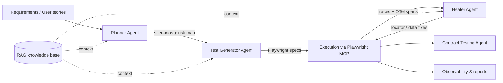

# Avinash Sharma

### QA Architect · Quality Engineering Leader

**QA Architect → Playwright → AI Testing → Agentic QA → Automation Architecture**

  
  
  
  

I design test automation architecture for enterprise programs and build the AI layer on top of it: Playwright-based frameworks, MCP-driven agents that plan, generate and heal tests, and observability that treats test runs as production telemetry. Ten-plus years across healthcare, IoT, recruitment, blockchain and enterprise finance, currently leading QA automation at NewVision Software, Bhopal, India.

---

## Core expertise

| Area | Depth |
|---|---|
| **Test automation architecture** | Layered frameworks (UI · API · contract · data · mobile), page-object and fixture design, parallel execution strategy, test-as-production-code standards |
| **Playwright (TypeScript / JavaScript)** | Framework design, custom fixtures and reporters, trace-based debugging, cross-browser and API testing in one runtime |
| **AI-driven testing** | Playwright MCP, LLM-based test generation, self-healing locators, RAG over test knowledge bases, LLM output evaluation |
| **API & contract testing** | REST automation (Postman, RestAssured), consumer-driven contracts with Pact, schema-drift detection, contract-testing agents |
| **CI/CD & cloud** | Azure DevOps pipelines, GitHub Actions, Docker-based runners, quality gates, sharded execution |
| **Legacy modernisation** | Tosca and Selenium suites migrated to Playwright with tooling, not rewrites |
| **Observability & performance** | OpenTelemetry for test runs, JMeter load profiles, failure clustering, flaky-test analytics |

## AI + QA innovation

Agentic QA, as I build it, is a pipeline of narrow, auditable agents rather than one model asked to "test the app".

| Capability | What it does |
|---|---|
| **Playwright MCP** | Exposes the browser to LLM agents through the Model Context Protocol so agents act on real pages, not guessed DOM |
| **Planner Agent** | Turns requirements into a risk-weighted scenario plan with coverage gaps called out |
| **Test Generator Agent** | Produces Playwright TypeScript specs that follow the framework's fixtures and page objects |
| **Healer Agent** | Analyses failing traces, proposes locator and test-data repairs, opens reviewable changes |
| **AI-assisted maintenance** | Failure clustering and root-cause hints across regression runs |
| **Tosca-to-Playwright migration** | Parses Tosca assets and emits page-object-based Playwright projects |
| **No-code / low-code automation (Playtest)** | Business-readable steps compiled onto the Playwright engine |
| **Automated web crawler** | Discovers pages, forms and flows to seed test generation and accessibility checks |
| **Contract-testing agents** | Generate and verify Pact contracts from API specs and observed traffic |
| **RAG & LLM testing** | Retrieval over test knowledge; groundedness and regression checks for LLM features |

## Architecture & engineering focus

- **Tests are software.** Reviewed, versioned, observable, with the same standards as the product they protect.
- **Layered quality gates.** Contract and API checks fail fast; UI suites are sharded and deterministic; performance runs on a schedule with baselines.
- **Human in the loop for AI.** Agents propose; engineers approve. Every generated test carries its provenance.
- **Telemetry over screenshots.** OpenTelemetry spans per step link test failures to backend traces, so triage starts with data.
- **Migration by tooling.** Legacy Tosca and Selenium estates are converted, not manually rewritten.

## Featured projects

| Project | Summary | Stack | Repo |
|---|---|---|---|
| **Playwright AI Automation Framework** | Playwright + TypeScript framework with MCP integration, Planner / Generator / Healer agents, fixtures, reporters and CI templates | TypeScript, Playwright, MCP, OpenAI / Azure AI | [PROJECT_REPOSITORY_URL] |
| **Playtest – No-Code / Low-Code Playwright Engine** | Business-readable test authoring compiled onto the Playwright runtime; reporting and CI included | TypeScript, Playwright, Node.js | [PROJECT_REPOSITORY_URL] |
| **Tosca-to-Playwright Converter** | Parses Tosca test assets and generates a page-object-based Playwright project | JavaScript, Playwright | [Tosca2PlayWright](https://github.com/Avinash258/Tosca2PlayWright) |
| **AI Test Case Generator** | Requirement-to-scenario generation with coverage and gap analysis, RAG-backed | Python, LangChain, RAG | [PROJECT_REPOSITORY_URL] |
| **Automated Web Crawler** | Crawls an application to map pages, forms and flows; seeds test generation and accessibility audits | TypeScript, Playwright | [PROJECT_REPOSITORY_URL] |
| **Contract Testing / Pact Framework** | Consumer-driven contract testing with broker integration and CI verification gates | Pact, TypeScript / Java | [PROJECT_REPOSITORY_URL] |
| **Playwright CI/CD Framework** | Sharded Playwright execution on Azure DevOps and GitHub Actions with Docker runners and quality gates | Azure DevOps, GitHub Actions, Docker | [PROJECT_REPOSITORY_URL] |
| **AI Testing Toolkit** | Utilities for LLM output evaluation, accessibility auditing and trace-to-API extraction | Python, TypeScript, Gemini / OpenAI | [PROJECT_REPOSITORY_URL] |
| **OpenTelemetry for Test Automation** | OTel instrumentation for Playwright runs: spans per step, links to backend traces, failure analytics | TypeScript, OpenTelemetry | [PROJECT_REPOSITORY_URL] |

## Technology stack

| Layer | Technologies |
|---|---|
| **UI automation** | Playwright · Selenium · Cypress · WebdriverIO · Tosca |
| **Languages** | TypeScript · JavaScript · Java · Python · SQL |
| **API & contract** | REST · Postman · RestAssured · Pact |
| **AI** | OpenAI · Azure AI · LangChain · RAG · Playwright MCP · LLM testing · AI agents |
| **Performance & data** | JMeter · SQL · Snowflake |
| **CI/CD & cloud** | Azure · Azure DevOps · GitHub Actions · Docker |
| **Observability** | OpenTelemetry · trace-based debugging |

## Professional impact

| Initiative | Documented outcome |
|---|---|
| Playwright MCP and framework architecture | 35–40% reduction in automation setup and maintenance effort |
| Playtest no-code / low-code engine | ~50% reduction in automation development effort |
| Tosca-to-Playwright converter | ~60% reduction in migration effort |
| AI-assisted test generation | 25–30% improvement in automation coverage |
| Sharded CI/CD execution and quality gates | 25–30% faster regression cycles |
| Copilot-assisted development practices across the team | ~40% productivity improvement |

## Certifications & speaking

- **Microsoft Certified: Azure Solutions Architect Expert** (2026)
- **Microsoft Certified: Azure Developer Associate (AZ-204)** and **Azure Administrator Associate (AZ-104)** (2025)
- **Tricentis Tosca:** Automation Specialist L1 & L2 · Automation Engineer L1 · Test Design Specialist L1 & L2
- **Speaker:** Agile Testing Alliance Global Testing Retreat, #ATAGTR2025
- **Credmark:** Top 10% Playwright practitioners worldwide (2025)

## Current focus

- Hardening the Planner → Generator → Healer loop with evaluation datasets and regression thresholds
- OpenTelemetry-native test reporting that correlates test spans with service traces
- Contract-testing agents that derive Pact contracts from OpenAPI specs and observed traffic
- Simulation-first Physical AI: a robot-arm chess player built as a sense → plan → safety-gate → act pipeline

## GitHub statistics

  
  

## Activity

  

## Contact

| | |
|---|---|
| **LinkedIn** | [linkedin.com/in/p-avinash-sharma-8b0203b9](https://www.linkedin.com/in/p-avinash-sharma-8b0203b9/) |
| **Email** | [avinashautomationqa@hotmail.com](mailto:avinashautomationqa@hotmail.com) |
| **YouTube** | [Playwright, Tosca and AI-testing tutorials](https://www.youtube.com/playlist?list=PLiUZog8eJ3L625AL1TLkZ7xWOsvK7AKre) |
| **Open to** | QA Architect roles · automation transformation consulting · framework and pipeline audits |

---

<i>Quality engineering scales when automation is architected, observable and increasingly autonomous. That is the work.</i>

