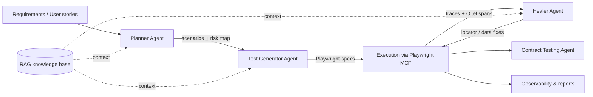

# Avinash Sharma

### QA Architect · Quality Engineering Leader

**QA Architect → Playwright → AI Testing → Agentic QA → Automation Architecture**

  
  
  
  

I design test automation architecture for enterprise programs and build the AI layer on top of it: Playwright-based frameworks, MCP-driven agents that plan, generate and heal tests, and observability that treats test runs as production telemetry. Ten-plus years across healthcare, IoT, recruitment, blockchain and enterprise finance, currently leading QA automation at NewVision Software, Bhopal, India.

---

## Core expertise

| Area | Depth |
|---|---|
| **Test automation architecture** | Layered frameworks (UI · API · contract · data · mobile), page-object and fixture design, parallel execution strategy, test-as-production-code standards |
| **Playwright (TypeScript / JavaScript)** | Framework design, custom fixtures and reporters, trace-based debugging, cross-browser and API testing in one runtime |
| **AI-driven testing** | Playwright MCP, LLM-based test generation, self-healing locators, RAG over test knowledge bases, LLM output evaluation |
| **API & contract testing** | REST automation (Postman, RestAssured), consumer-driven contracts with Pact, schema-drift detection, contract-testing agents |
| **CI/CD & cloud** | Azure DevOps pipelines, GitHub Actions, Docker-based runners, quality gates, sharded execution |
| **Legacy modernisation** | Tosca and Selenium suites migrated to Playwright with tooling, not rewrites |
| **Observability & performance** | OpenTelemetry for test runs, JMeter load profiles, failure clustering, flaky-test analytics |

## AI + QA innovation

Agentic QA, as I build it, is a pipeline of narrow, auditable agents rather than one model asked to "test the app".

| Capability | What it does |
|---|---|
| **Playwright MCP** | Exposes the browser to LLM agents through the Model Context Protocol so agents act on real pages, not guessed DOM |
| **Planner Agent** | Turns requirements into a risk-weighted scenario plan with coverage gaps called out |
| **Test Generator Agent** | Produces Playwright TypeScript specs that follow the framework's fixtures and page objects |
| **Healer Agent** | Analyses failing traces, proposes locator and test-data repairs, opens reviewable changes |
| **AI-assisted maintenance** | Failure clustering and root-cause hints across regression runs |
| **Tosca-to-Playwright migration** | Parses Tosca assets and emits page-object-based Playwright projects |
| **No-code / low-code automation (Playtest)** | Business-readable steps compiled onto the Playwright engine |
| **Automated web crawler** | Discovers pages, forms and flows to seed test generation and accessibility checks |
| **Contract-testing agents** | Generate and verify Pact contracts from API specs and observed traffic |
| **RAG & LLM testing** | Retrieval over test knowledge; groundedness and regression checks for LLM features |

## Architecture & engineering focus

- **Tests are software.** Reviewed, versioned, observable, with the same standards as the product they protect.
- **Layered quality gates.** Contract and API checks fail fast; UI suites are sharded and deterministic; performance runs on a schedule with baselines.
- **Human in the loop for AI.** Agents propose; engineers approve. Every generated test carries its provenance.
- **Telemetry over screenshots.** OpenTelemetry spans per step link test failures to backend traces, so triage starts with data.
- **Migration by tooling.** Legacy Tosca and Selenium estates are converted, not manually rewritten.

## Enterprise platforms (private)

These platforms live in private / client repositories. Public source is not available; capability and outcomes are summarised below.

| Platform | About the work | What makes it strong |
|---|---|---|
| **DevEval Framework** *(private)* | Enterprise evaluation framework for developer and QA automation quality — scoring framework health, coverage depth, flaky-test rate, CI feedback time, and maintainability of Playwright / Selenium suites. Used to baseline teams and track improvement across programs. | Gives leadership a **measurable quality scorecard** instead of anecdotal status · Highlights weak layers (UI vs API vs contract) before release risk grows · Standardises how automation maturity is compared across projects · Feeds Copilot / agent-assisted remediation priorities |
| **AIQA Platform** *(private)* | End-to-end AI quality platform: Planner → Generator → Healer agents on Playwright MCP, RAG over project knowledge, AI test-case generation, contract-testing agents, and OpenTelemetry-backed run analytics. Powers no-code / low-code authoring (Playtest) and Tosca-to-Playwright migration tooling for delivery teams. | **Agentic QA with human review** — agents propose, engineers approve · Cuts automation setup / maintenance effort **35–40%** and development effort **~50%** on Playtest paths · Speeds Tosca → Playwright migration by **~60%** · Improves coverage **25–30%** and regression cycle time **25–30%** · One platform for UI, API, contract, and LLM-feature testing |

### DevEval — outcomes teams care about

- Framework health score (structure, reuse, flake rate, Parallelisation readiness)
- Coverage and risk heatmaps by module and test layer
- Actionable backlog: what to fix first for the largest quality gain
- Consistent evaluation model across NewVision delivery programs

### AIQA — outcomes teams care about

- AI-generated Playwright specs that follow the house framework (fixtures, POM, reporters)
- Self-healing locator / data proposals from failing traces
- Contract and API gates in CI before UI suites run
- Knowledge-backed generation (RAG) so suggestions stay project-aware
- Observability: test spans correlated with service behaviour, not only screenshots

> Source code for DevEval and AIQA remains private. For demos, architecture walkthroughs, or consulting, reach out via [LinkedIn](https://www.linkedin.com/in/p-avinash-sharma-8b0203b9/) or [email](mailto:avinashautomationqa@hotmail.com).

## Featured projects (public)

| Project | Summary | Stack | Repository |
|---|---|---|---|
| [**Playwright AI Automation Framework**](https://github.com/Avinash258/PlaywrightMCPAgents) | Playwright + TypeScript framework with MCP integration, Planner / Generator / Healer agents, fixtures, reporters and CI templates | TypeScript, Playwright, MCP, OpenAI / Azure AI | [github.com/Avinash258/PlaywrightMCPAgents](https://github.com/Avinash258/PlaywrightMCPAgents) [github.com/Avinash258/PlaywrightMCPAgent](https://github.com/Avinash258/PlaywrightMCPAgent) |
| [**Playtest – No-Code / Low-Code Playwright Engine**](https://github.com/Avinash258/eyPOC) | Business-readable test authoring compiled onto the Playwright runtime; reporting and CI included | TypeScript, Playwright, Node.js | [github.com/Avinash258/eyPOC](https://github.com/Avinash258/eyPOC) |
| [**Tosca-to-Playwright Converter**](https://github.com/Avinash258/Tosca2PlayWright) | Parses Tosca test assets and generates a page-object-based Playwright project | JavaScript, Playwright | [github.com/Avinash258/Tosca2PlayWright](https://github.com/Avinash258/Tosca2PlayWright) |
| [**AI Test Case Generator**](https://github.com/Avinash258/AI-Shadow-Product-Owner) | Requirement-to-scenario generation with coverage and gap analysis, RAG-backed | Python, LangChain, RAG | [github.com/Avinash258/AI-Shadow-Product-Owner](https://github.com/Avinash258/AI-Shadow-Product-Owner) [github.com/Avinash258/RagBaseSolution](https://github.com/Avinash258/RagBaseSolution) |
| [**Automated Web Crawler / Accessibility Auditor**](https://github.com/Avinash258/AI-accessibilty-Auditor) | Maps pages and flows; AI-powered WCAG / ADA / Section 508 audits with multi-format reports | TypeScript, Playwright, Gemini | [github.com/Avinash258/AI-accessibilty-Auditor](https://github.com/Avinash258/AI-accessibilty-Auditor) |
| [**Contract Testing Framework**](https://github.com/Avinash258/contractdev2) | Consumer-driven contract testing with broker-style verification and CI gates | JavaScript, Pact / contract checks | [github.com/Avinash258/contractdev2](https://github.com/Avinash258/contractdev2) |
| [**Playwright CI/CD Framework**](https://github.com/Avinash258/PlaywrightTSFrameWork) | Sharded Playwright execution on Azure DevOps and GitHub Actions with quality gates | Azure DevOps, GitHub Actions, TypeScript | [github.com/Avinash258/PlaywrightTSFrameWork](https://github.com/Avinash258/PlaywrightTSFrameWork) [github.com/Avinash258/HTD2.0Azure](https://github.com/Avinash258/HTD2.0Azure) [github.com/Avinash258/PlaywrightADO](https://github.com/Avinash258/PlaywrightADO) |
| [**AI Testing Toolkit**](https://github.com/Avinash258/TraceViewer) | Trace-to-API extraction, Postman collection export, LLM utilities and accessibility tooling | Python, TypeScript, Gemini / OpenAI | [github.com/Avinash258/TraceViewer](https://github.com/Avinash258/TraceViewer) [github.com/Avinash258/AI-accessibilty-Auditor](https://github.com/Avinash258/AI-accessibilty-Auditor) |
| [**Playwright POM Starter**](https://github.com/Avinash258/playwright-page-object-master) | Page-object Playwright scaffold used as the base for framework rollouts | JavaScript, Playwright | [github.com/Avinash258/playwright-page-object-master](https://github.com/Avinash258/playwright-page-object-master) |

## Tech Stack

  

| Layer | Technologies |
|---|---|
| **UI automation** | Playwright · Selenium · Cypress · WebdriverIO · Tosca · Appium |
| **Languages** | TypeScript · JavaScript · Java · Python · SQL |
| **API & contract** | REST · Postman · RestAssured · Pact · GraphQL |
| **AI / Agentic QA** | Playwright MCP · OpenAI · Azure AI · LangChain · RAG · LLM testing · AI agents |
| **Private platforms** | **AIQA Platform** · **DevEval Framework** · Playtest (no-code / low-code) |
| **Performance & data** | JMeter · SQL · Snowflake · MongoDB |
| **CI/CD & cloud** | Azure · Azure DevOps · GitHub Actions · Docker · Jenkins |
| **Observability** | OpenTelemetry · Playwright Trace · failure analytics |

## Currently learning / building

  
  
  
  
  
  
  
  
  

- Hardening the AIQA Planner → Generator → Healer loop with evaluation datasets and regression thresholds
- Expanding **DevEval** scorecards (flake rate, coverage depth, CI feedback time, framework health)
- OpenTelemetry-native test reporting that correlates test spans with service traces
- Contract-testing agents that derive Pact contracts from OpenAPI specs and observed traffic
- Simulation-first Physical AI: sense → plan → safety-gate → act

## Professional impact

| Initiative | Documented outcome |
|---|---|
| **AIQA Platform** (private) — Playwright MCP, agents, Playtest | 35–40% less setup/maintenance · ~50% less automation development effort · 25–30% better coverage · 25–30% faster regression |
| **DevEval Framework** (private) — automation maturity scorecards | Consistent quality baselines across programs; clearer remediation priorities for framework health and flake reduction |
| Tosca-to-Playwright converter | ~60% reduction in migration effort |
| Copilot-assisted development practices across the team | ~40% productivity improvement |

## Certifications & speaking

- **Microsoft Certified: Azure Solutions Architect Expert** (2026)
- **Microsoft Certified: Azure Developer Associate (AZ-204)** and **Azure Administrator Associate (AZ-104)** (2025)
- **Tricentis Tosca:** Automation Specialist L1 & L2 · Automation Engineer L1 · Test Design Specialist L1 & L2
- **Speaker:** Agile Testing Alliance Global Testing Retreat, #ATAGTR2025
- **Credmark:** Top 10% Playwright practitioners worldwide (2025)

## GitHub statistics

  
  

## Activity

  

## Let's connect

  
  
  
  
  

Open to <b>QA Architect</b> roles · automation transformation consulting · framework and pipeline audits · DevEval / AIQA demos

---

<i>Quality engineering scales when automation is architected, observable and increasingly autonomous. That is the work.</i>

