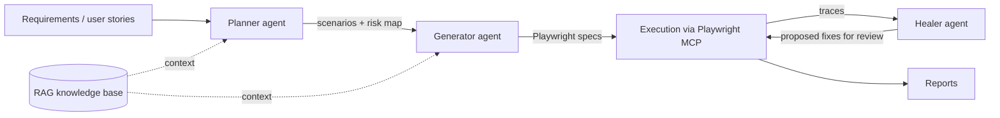

# Avinash Sharma

### QA Automation Architect · Lead SDET · Playwright TS SME · AIQA / DeepEVL

**Playwright · TypeScript · AI Testing · Agentic QA · MCP · Quality Engineering**

  
  
  
  

I design test automation architecture for enterprise programs and build the AI layer on top of it: Playwright-based frameworks, MCP-driven agents that plan, generate and heal tests, and observability that treats test runs as production telemetry. More than a decade across healthcare, IoT, recruitment, blockchain and enterprise finance — leading QA automation at **NewVision Software, Bhopal, India** (remote-ready).

---

## Core expertise

| Area | Depth |
|---|---|
| **Test automation architecture** | Layered frameworks (UI · API · contract · data · mobile), page-object and fixture design, parallel execution strategy, test-as-production-code standards |
| **Playwright (TypeScript / JavaScript)** | Framework design, custom fixtures and reporters, trace-based debugging, cross-browser and API testing in one runtime |
| **AI-driven testing** | Playwright MCP, LLM-based test generation, self-healing locators, RAG over test knowledge bases, LLM output evaluation |
| **API & contract testing** | REST automation (Postman, RestAssured), consumer-driven contracts with Pact, schema-drift detection |
| **CI/CD & cloud** | Azure DevOps pipelines, GitHub Actions, Docker-based runners, quality gates, sharded execution |
| **Legacy modernisation** | Tosca and Selenium suites migrated to Playwright with tooling, not rewrites |
| **Observability & performance** | Playwright Trace analytics, failure clustering, JMeter load profiles · OpenTelemetry for test runs *(in progress)* |

## AI + QA innovation

Agentic QA, as I build it, is a pipeline of narrow, auditable agents rather than one model asked to "test the app".

```mermaid
flowchart LR
    R[Requirements / user stories] --> P[Planner agent]
    P -->|scenarios + risk map| G[Generator agent]
    G -->|Playwright specs| X[Execution via Playwright MCP]
    X -->|traces| H[Healer agent]
    H -->|proposed fixes for review| X
    KB[(RAG knowledge base)] -.context.-> P
    KB -.context.-> G
    X --> O[Reports]
```

*In progress (not yet public end-to-end):* OpenTelemetry-native reporting beyond the [`playwright-otel-reporter`](https://github.com/Avinash258/playwright-otel-reporter) JSON exporter · contract agents that derive Pact from OpenAPI.
| Capability | What it does |
|---|---|
| **Playwright MCP** | Exposes the browser to LLM agents through the Model Context Protocol so agents act on real pages, not guessed DOM |
| **Planner Agent** | Turns requirements into a risk-weighted scenario plan with coverage gaps called out |
| **Test Generator Agent** | Produces Playwright specs aligned to house fixtures and page objects |
| **Healer Agent** | Analyses failing traces, proposes locator and test-data repairs for human review |
| **Tosca-to-Playwright migration** | Parses Tosca assets and emits page-object-based Playwright projects |
| **Playtest (no-code / low-code)** | Business-readable steps compiled onto the Playwright engine |
| **RAG & LLM testing** | Retrieval over test knowledge; grounded Q&A for Playwright / QA practices |

## Architecture & engineering focus

- **Tests are software.** Reviewed, versioned, observable, with the same standards as the product they protect.
- **Layered quality gates.** Contract and API checks fail fast; UI suites are sharded and deterministic.
- **Human in the loop for AI.** Agents propose; engineers approve. Every generated test carries its provenance.
- **Migration by tooling.** Legacy Tosca and Selenium estates are converted, not manually rewritten.

## Enterprise platforms (private)

These platforms live in private / client repositories. Public source is not available; capability and outcomes are summarised below.

| Platform | About the work | What makes it strong |
|---|---|---|
| **DeepEVL Framework** *(private)* | Enterprise evaluation framework for developer and QA automation quality — scoring framework health, coverage depth, flaky-test rate, CI feedback time, and maintainability of Playwright / Selenium suites. | Measurable quality scorecard · weak-layer visibility · consistent maturity baselines · remediation priorities |
| **AIQA Platform** *(private)* | End-to-end AI quality platform: Planner → Generator → Healer on Playwright MCP, RAG, contract checks, Playtest authoring, Tosca→Playwright tooling. | Agentic QA with human review · documented delivery outcomes on client programs |

> Source for DeepEVL and AIQA remains private. For demos or architecture walkthroughs: [LinkedIn](https://www.linkedin.com/in/p-avinash-sharma-8b0203b9/) or [email](mailto:avinashautomationqa@hotmail.com).

## Featured projects (public)

Top five flagships. One row = one repo. Related work is linked from each README.

| # | Project | Summary | Stack | Repository |
|---|---|---|---|---|
| 1 | [**Playwright MCP Agents**](https://github.com/Avinash258/PlaywrightMCPAgents) | Agentic browser automation on Playwright MCP — Planner / Generator / Healer loops producing reviewable specs | JavaScript, Playwright, MCP | [PlaywrightMCPAgents](https://github.com/Avinash258/PlaywrightMCPAgents) |
| 2 | [**Playtest QA Platform**](https://github.com/Avinash258/eyPOC) | Unified TypeScript QA platform: UI, API, Pact contracts, performance and Allure reporting | TypeScript, Playwright, Pact | [eyPOC](https://github.com/Avinash258/eyPOC) |
| 3 | [**Tosca → Playwright**](https://github.com/Avinash258/Tosca2PlayWright) | Converts Tosca assets into a page-object Playwright project | Python, JavaScript, Playwright | [Tosca2PlayWright](https://github.com/Avinash258/Tosca2PlayWright) |
| 4 | [**Playwright TS Framework**](https://github.com/Avinash258/PlaywrightTSFrameWork) | Production-style POM framework with sharded CI on Azure DevOps / GitHub Actions | TypeScript, Playwright, Azure DevOps | [PlaywrightTSFrameWork](https://github.com/Avinash258/PlaywrightTSFrameWork) |
| 5 | [**Contract Testing**](https://github.com/Avinash258/contractdev2) | Consumer-driven contract testing for GraphQL / gRPC with Pact-style verification | JavaScript, Pact, Jest | [contractdev2](https://github.com/Avinash258/contractdev2) |

### Other public projects

| Project | Summary | Stack | Repository |
|---|---|---|---|
| [AI Test Case Generator](https://github.com/Avinash258/AI-Shadow-Product-Owner) | Requirement → scenarios with coverage / gap analysis | React, TypeScript, Vite, Gemini | [AI-Shadow-Product-Owner](https://github.com/Avinash258/AI-Shadow-Product-Owner) |
| [Playwright RAG Chatbot](https://github.com/Avinash258/RagBaseSolution) | Local RAG over Playwright testing knowledge (ChromaDB + Ollama) | Python, ChromaDB, Ollama | [RagBaseSolution](https://github.com/Avinash258/RagBaseSolution) |
| [AI Accessibility Auditor](https://github.com/Avinash258/AI-accessibilty-Auditor) | URL-based WCAG / ADA / Section 508 oriented audits via Gemini | React, TypeScript, Gemini | [AI-accessibilty-Auditor](https://github.com/Avinash258/AI-accessibilty-Auditor) |
| [Trace → Postman](https://github.com/Avinash258/TraceViewer) | Playwright `trace.zip` → sequenced API breakup + Postman v2.1 | Python | [TraceViewer](https://github.com/Avinash258/TraceViewer) |
| [Playwright POM Starter](https://github.com/Avinash258/playwright-page-object-master) | Page Object Model starter for framework rollouts | JavaScript / TypeScript, Playwright | [playwright-page-object-master](https://github.com/Avinash258/playwright-page-object-master) |
| [HTD 2.0 Azure training](https://github.com/Avinash258/HTD2.0Azure) | Sauce Demo POM baseline for Azure-oriented training | TypeScript, Playwright | [HTD2.0Azure](https://github.com/Avinash258/HTD2.0Azure) |

## Tech stack (public evidence)

  

| Layer | Technologies |
|---|---|
| **UI automation** | Playwright · Selenium · Tosca |
| **Languages** | TypeScript · JavaScript · Java · Python · SQL |
| **API & contract** | REST · Postman · RestAssured · Pact · GraphQL |
| **AI / Agentic QA** | Playwright MCP · OpenAI / Azure AI · Gemini · RAG · Ollama |
| **Private platforms** | **AIQA Platform** · **DeepEVL Framework** · Playtest |
| **CI/CD & cloud** | Azure · Azure DevOps · GitHub Actions · Docker |
| **Observability** | Playwright Trace · failure analytics |

## Growth releases (Phase 4)

| Release | What it proves | Link |
|---|---|---|
| **Playwright MCP Agents v0.1** | Planner → Generator → Healer demo walkthrough + SauceDemo generated cart spec + CI | [PlaywrightMCPAgents](https://github.com/Avinash258/PlaywrightMCPAgents) · [Demo docs](https://github.com/Avinash258/PlaywrightMCPAgents/blob/main/docs/DEMO.md) |
| **playwright-sharded-ci v0.1** | Reusable GitHub Action: N parallel shards → merged HTML report | [playwright-sharded-ci](https://github.com/Avinash258/playwright-sharded-ci) |
| **playwright-otel-reporter v0.1** | Custom Playwright reporter → OpenTelemetry-style JSON spans | [playwright-otel-reporter](https://github.com/Avinash258/playwright-otel-reporter) |

## Currently learning / building

  
  
  
  
  
  
  
  

- Hardening the AIQA Planner → Generator → Healer loop with evaluation datasets *(private platform)*
- Expanding **DeepEVL** scorecards (flake rate, coverage depth, CI feedback time) *(private platform)*
- OTLP/HTTP export for [`playwright-otel-reporter`](https://github.com/Avinash258/playwright-otel-reporter) *(next)*
- Contract-testing agents that derive Pact contracts from OpenAPI *(in progress)*
- Demo video for the MCP agents walkthrough *(record + link from README)*

## Professional impact

Outcomes from delivery programs (private platforms / client work). Figures are delivery-team measurements, not public benchmarks.

| Initiative | Documented outcome |
|---|---|
| **AIQA Platform** (private) — Playwright MCP, agents, Playtest | 35–40% less setup/maintenance · ~50% less automation development effort · 25–30% better coverage · 25–30% faster regression |
| **DeepEVL Framework** (private) — automation maturity scorecards | Consistent quality baselines; clearer remediation priorities |
| Tosca-to-Playwright converter | ~60% reduction in migration effort |
| Copilot-assisted development practices | ~40% productivity improvement |

## Speaking

- **Speaker — Global Testing Retreat 2025 (#ATAGTR2025)** — Agile Testing Alliance · 22–23 Nov 2025 (Virtual) · 14 Dec 2025 (Pune) · [Certificate](https://certificate.givemycertificate.com/c/b0b33736-023f-4f0d-92eb-efbc41509743)

## Licenses & certifications

- **Microsoft Certified: Azure Solutions Architect Expert** (2026)
- **Microsoft Certified: Azure Developer Associate (AZ-204)** and **Azure Administrator Associate (AZ-104)** (2025)
- **Tricentis Tosca:** Automation Specialist L1 & L2 · Automation Engineer L1 · Test Design Specialist L1 & L2
- **Credmark:** Top 10% Playwright practitioners worldwide (2025)

## Let's connect

  
  
  
  
  

Open to <b>QA Automation Architect</b> roles · automation transformation consulting · framework and pipeline audits · DeepEVL / AIQA demos

---

<i>Quality engineering scales when automation is architected, observable and increasingly autonomous. That is the work.</i>

